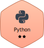
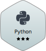
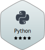
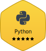
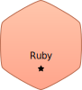
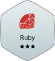
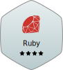

# Hi there 👋

# 🏆 My Achievements & Certifications

  

 

## 🏅 Hackerrank Badges

> Krutarth Raychura : [🔗 View Profile](https://www.hackerrank.com/profile/brucewaynes021)

  
  
  
  
  

  
  
  
  

 

## 📚 Latest Achievements

### 🐘 Database Design and Basic SQL in PostgreSQL
**Coursera • University of Michigan** | *August 23, 2025* | **5 hours** | **Grade: 100%**

**Skills:** PostgreSQL, Database Design, ER Modeling, SQL (DDL/DML), Joins, Keys, Constraints

[🔗 View Certificate](https://coursera.org/share/4a438e91b31e23374e2ec02108008772) | [📖 Course Info](https://www.coursera.org/learn/database-design-postgresql)

---

### 🤖 Learn to code with AI
**Coursera • Scrimba** | *August 21, 2025* | **5 hour** | **Grade: 92.82%**

**Skills:** HTML, CSS, JavaScript, Responsive Web Design, Debugging, Front-End Web Development, Database Applications (Firebase), Application Deployment, Version Control (GitHub), Mobile Development, Chrome Extension Development, Artificial Intelligence, ChatGPT

[🔗 View Certificate](https://coursera.org/share/eac74da628f38c1d22b97a33b0008998) | [📖 Course Info](https://www.coursera.org/learn/learn-to-code-with-ai)

---

### 🤖 Vibe Coding with GitHub Copilot
**Coursera • Scrimba** | *August 1, 2025* | **1 hour** | **Grade: 100%**

**Skills:** GitHub Copilot, AI Code Suggestions, Collaborative Development

[🔗 View Certificate](https://coursera.org/share/0a6df10d2e6a9207eb27f1abf92e3da3) | [📖 Course Info](https://www.coursera.org/learn/vibe-coding-github-copilot)

---

### 🎨 Vibe Coding with Cursor AI
**Coursera • Scrimba** | *August 1, 2025* | **1 hour** | **Grade: 100%**

**Skills:** Cursor IDE, AI-Powered Coding, Productivity Enhancement

[🔗 View Certificate](https://coursera.org/share/914692a5df14ae01560225521ade56f1) | [📖 Course Info](https://www.coursera.org/learn/vibe-coding-with-cursor-ai)

---

### 🔧 C++ For C Programmers, Part B
**Coursera • UC Santa Cruz** | *March 23, 2025* | **14 hours** | **Grade: 86.23%**

**Skills:** Advanced C++, Object-Oriented Programming, Data Structures, Algorithm Implementation

[🔗 View Certificate](https://coursera.org/share/f99abc00fb0e8b6e35d57c0f5af78560) | [📖 Course Info](https://www.coursera.org/learn/c-plus-plus-b)

---

### ☕ Introduction to Object-Oriented Programming with Java
**Coursera • LearnQuest** | *March 19, 2025* | **13 hours** | **Grade: 97.50%**

**Skills:** Object-Oriented Programming, Java Fundamentals, Programming Concepts, Software Development

[🔗 View Certificate](https://coursera.org/share/627631069713e7a7683978b2aeb3c454) | [📖 Course Info](https://www.coursera.org/learn/object-oriented-programming-with-java?specialization=core-java)

---

### 📊 R Programming
**Coursera • Johns Hopkins University** | *March 5, 2025* | **57 hours** | **Grade: 88.66%**

**Skills:** R Programming, Statistical Computing, Data Analysis, Data Visualization, Statistical Modeling

[🔗 View Certificate](https://coursera.org/share/298c670bfb3494bc75b2700cfe4b2a2d) | [📖 Course Info](https://www.coursera.org/learn/r-programming)

---

### 🌐 Mastering Laravel Framework and PHP
**Coursera • Board Infinity** | *January 31, 2025* | **15 hours** | **Grade: 96.49%**

**Skills:** Laravel Framework, PHP Development, Web Development, MVC Architecture, Backend Development

[🔗 View Certificate](https://coursera.org/share/114d2c781bb295c7d899fbfeeae6bbdc) | [📖 Course Info](https://www.coursera.org/learn/laravel-framework-and-php)

---

### 🏢 Client Service Job Simulation
**Forage • Bloomberg** | *January 9, 2025* | **3 hours**

**Skills:** Client Service, Customer Relations, Financial Services, Problem Solving, Professional Communication

[🔗 View Certificate](https://forage-uploads-prod.s3.amazonaws.com/completion-certificates/pNeDZ9MsW9WShojQm/sqYY2sxG2zNqXfHjJ_pNeDZ9MsW9WShojQm_7HteHgZganZLwTtu8_1736459775629_completion_certificate.pdf#toolbar=0&view=fitH) | [📖 Course Info](https://www.theforage.com/simulations/bloomberg/client-service-l3u2)

---

### 📊 Data Visualisation: Empowering Business with Effective Insights
**Forage • Tata Group** | *January 8, 2025* | **3 hours**

**Skills:** Data Visualization, Business Intelligence, Data Analysis, Effective Insights, Business Decision Making

[🔗 View Certificate](https://forage-uploads-prod.s3.amazonaws.com/completion-certificates/ifobHAoMjQs9s6bKS/MyXvBcppsW2FkNYCX_ifobHAoMjQs9s6bKS_7HteHgZganZLwTtu8_1736350730824_completion_certificate.pdf#toolbar=0&view=fitH) | [📖 Course Info](https://www.theforage.com/simulations/tata/data-visualisation-p5xo)

---

### 🎨 Canva 10 Design Milestone Badge
**Canva** | *August 30, 2024*

**Skills:** Graphic Design, Creative Thinking, Visual Communication, Design Consistency

[🔗 View Achievement](./Canva/Canva%2010%20Design%20Milestone%20Badge_20240830.gif)

---

### 🔧 C++ For C Programmers, Part A
**Coursera • UC Santa Cruz** | *August 2, 2024* | **14 hours** | **Grade: 91.87%**

**Skills:** C++ Programming, Memory Management, Object-Oriented Concepts, Programming Fundamentals

[🔗 View Certificate](https://coursera.org/share/e96981e6e4dad5a9314769fdc8791999) | [📖 Course Info](https://www.coursera.org/learn/c-plus-plus-a)

---

### 🌐 Learn Object-Oriented Programming with PHP
**Coursera • Coursera Project Network** | *August 1, 2024* | **1 hour** | **Grade: 100%**

**Skills:** PHP Object-Oriented Programming, Classes, Objects, Inheritance, Encapsulation

[🔗 View Certificate](https://coursera.org/share/ec363fa150e9d839d0f5f6efc2f13b8b) | [📖 Course Info](https://www.coursera.org/projects/oop-with-php)

---

### 🗄️ Understanding Basic SQL Syntax
**Coursera • Coursera Project Network** | *July 3, 2024* | **1 hour** | **Grade: 95.83%**

**Skills:** SQL Fundamentals, Database Queries, Data Manipulation, Database Management

[🔗 View Certificate](https://coursera.org/share/bda859da74fd462cff8aece16e89f827) | [📖 Course Info](https://www.coursera.org/projects/basic-sql-syntax)

---

### 🌐 Introduction to HTML
**Coursera • Coursera Project Network** | *July 3, 2024* | **2 hours** | **Grade: 100%**

**Skills:** HTML Fundamentals, Web Structure, Basic Markup, Web Development Basics

[🔗 View Certificate](https://coursera.org/share/c8d4f35fa557fecce7e4c06aedd6d4d4) | [📖 Course Info](https://www.coursera.org/projects/introduction-to-html)

---

### 📊 Google Sheets
**Coursera • Google Cloud** | *March 12, 2024* | **3 hours** | **Grade: 100%**

**Skills:** Spreadsheet Management, Data Analysis, Formulas, Charts, Google Workspace

[🔗 View Certificate](https://coursera.org/share/cd349f027f03dd4b210f0afe62136e8d) | [📖 Course Info](https://www.coursera.org/learn/google-sheets)

---

### 📧 Gmail
**Coursera • Google Cloud** | *March 12, 2024* | **3 hours** | **Grade: 95%**

**Skills:** Email Management, Professional Communication, Gmail Features, Google Workspace

[🔗 View Certificate](https://coursera.org/share/fd94892ed411f55637c0e2d692d4c5df) | [📖 Course Info](https://www.coursera.org/learn/gmail)

---

### 📽️ Google Slides
**Coursera • Google Cloud** | *March 12, 2024* | **3 hours** | **Grade: 77.50%**

**Skills:** Presentation Design, Visual Communication, Google Workspace, Collaboration

[🔗 View Certificate](https://coursera.org/share/f07cb3d07c3fbb250bfa1dd75dd24ff3) | [📖 Course Info](https://www.coursera.org/learn/google-slides)

---

### 💾 Google Drive
**Coursera • Google Cloud** | *March 11, 2024* | **2 hours** | **Grade: 100%**

**Skills:** Cloud Storage, File Management, Collaboration, Google Workspace

[🔗 View Certificate](https://coursera.org/share/e2c0e48faef8dc369c40d6fdd7d6b1a5) | [📖 Course Info](https://www.coursera.org/learn/google-drive)

---

### 🤖 ChatGPT for Beginners: Save time with Microsoft Excel
**Coursera • Coursera Project Network** | *March 11, 2024* | **3 hours** | **Grade: 100%**

**Skills:** ChatGPT Integration, Microsoft Excel Automation, AI-Powered Productivity, Spreadsheet Optimization, Time Management

[🔗 View Certificate](https://coursera.org/share/f3ac53a71fa2c7a08298f2aa7ac26a3a) | [📖 Course Info](https://www.coursera.org/projects/chatgpt-for-beginners-save-time-with-microsoft-excel)

---

### 📅 Google Calendar
**Coursera • Google Cloud** | *March 10, 2024* | **2 hours** | **Grade: 100%**

**Skills:** Time Management, Scheduling, Calendar Management, Google Workspace

[🔗 View Certificate](https://coursera.org/share/9b31960a07318c66253094eedb3020eb) | [📖 Course Info](https://www.coursera.org/learn/google-calendar)

---

### 🔀 Introduction to Git and GitHub
**Coursera • Google** | *March 10, 2024* | **20 hours** | **Grade: 90%**

**Skills:** Version Control, Git Commands, GitHub Workflows, Collaborative Development, Repository Management

[🔗 View Certificate](https://coursera.org/share/d67743fe6a66fe638e7d30aac4fabf5c) | [📖 Course Info](https://www.coursera.org/learn/introduction-git-github)

---

### 🌐 Interactivity with JavaScript
**Coursera • University of Michigan** | *March 6, 2024* | **9 hours** | **Grade: 93.66%**

**Skills:** JavaScript Programming, DOM Manipulation, Event Handling, Interactive Web Development

[🔗 View Certificate](https://coursera.org/share/2cf8b3dc19ed86ec97dad7c00bdd2406) | [📖 Course Info](https://www.coursera.org/learn/javascript)

---

### 🗄️ Introduction to Relational Databases (RDBMS)
**Coursera • IBM** | *March 6, 2024* | **15 hours** | **Grade: 88.65%**

**Skills:** Relational Database Management Systems, Database Design, SQL Fundamentals, Data Modeling, Database Administration

[🔗 View Certificate](https://coursera.org/share/35397bb989c5620795f87d1e48337938) | [📖 Course Info](https://www.coursera.org/learn/introduction-to-relational-databases)

---

### 📊 Prepare, Clean, Transform, and Load Data using Power BI
**Coursera • Coursera Project Network** | *March 6, 2024* | **2 hours** | **Grade: 100%**

**Skills:** Power BI, Data Transformation, ETL Processes, Data Visualization, Business Intelligence

[🔗 View Certificate](https://coursera.org/share/ade518469c36da863eba931ff2f4c82e) | [📖 Course Info](https://www.coursera.org/projects/prepare-clean-transform-and-load-data-using-powerbi)

---

### 📝 Google Docs
**Coursera • Google Cloud** | *March 5, 2024* | **2 hours** | **Grade: 100%**

**Skills:** Document Creation, Collaborative Writing, Google Workspace, Professional Documentation

[🔗 View Certificate](https://coursera.org/share/efef9e92b5ccfb9de921ac79bba4761d) | [📖 Course Info](https://www.coursera.org/learn/google-docs)

---

### 🎨 CSS Crash Course For Beginners
**Udemy** | *January 28, 2024* | **1 hour**

**Skills:** CSS Fundamentals, Styling Techniques, Web Design, Frontend Development, Responsive Design

[🔗 View Certificate](https://www.udemy.com/certificate/UC-21600d4b-23ae-43d5-b89a-85e039bb3cab/) | [📖 Course Info](https://www.udemy.com/course/css-crash-course-for-beginners-g/)

---

### 📊 Data Visualization With Power BI
**Great Learning** | *January 2024* | **1.5 hours**

**Skills:** Power BI, Data Visualization, Business Intelligence, Dashboard Creation, Data Analysis

[🔗 View Certificate](https://www.mygreatlearning.com/certificate/OWWLLLTE) | [📖 Course Info](https://www.mygreatlearning.com/academy/learn-for-free/courses/data-visualization-with-power-bi)

---

### 💬 Effective Communication
**Great Learning** | *January 2024* | **1 hour**

**Skills:** Communication Skills, Professional Communication, Interpersonal Skills, Presentation Skills, Workplace Communication

[🔗 View Certificate](https://www.mygreatlearning.com/certificate/JQJLPMIH) | [📖 Course Info](https://www.mygreatlearning.com/academy/learn-for-free/courses/effective-communication)

---

### 💻 Problem Solving with C programming language
**Udemy** | *January 24, 2024* | **5 hours**

**Skills:** C Programming, Problem Solving, Algorithm Development, Programming Logic, Computational Thinking

[🔗 View Certificate](https://www.udemy.com/certificate/UC-f1faa02e-2837-4840-a7e5-c177e7c7ec4c/) | [📖 Course Info](https://www.udemy.com/course/problem-solving-with-c-programming-language/)

---

### 📽️ Microsoft PowerPoint Tutorial
**Great Learning** | *January 2024* | **1.5 hours**

**Skills:** Microsoft PowerPoint, Presentation Design, Visual Communication, Slide Creation, Professional Presentations

[🔗 View Certificate](https://www.mygreatlearning.com/certificate/AGCZGAJT) | [📖 Course Info](https://www.mygreatlearning.com/academy/learn-for-free/courses/microsoft-powerpoint-tutorial)

---

### 📝 Create a Resume and Cover Letter with Google Docs
**Coursera • Coursera Project Network** | *January 15, 2024* | **3 hours** | **Grade: 100%**

**Skills:** Professional Document Creation, Resume Writing, Cover Letter Design, Google Docs Mastery, Career Development

[🔗 View Certificate](https://coursera.org/share/af2c72bd40e73bf851d44e191ed45a03) | [📖 Course Info](https://www.coursera.org/projects/create-resume-cover-letter-google-docs)

---

### 💻 Mastering Pointers in C : A Course on Efficient Programming
**Udemy** | *January 15, 2024* | **3 hours**

**Skills:** C Programming, Pointer Management, Memory Management, Efficient Programming, Advanced C Concepts

[🔗 View Certificate](https://www.udemy.com/certificate/UC-63c017f3-0a7b-4bce-83fe-273819749917/) | [📖 Course Info](https://www.udemy.com/course/mastering-pointers-in-c-a-course-on-efficient-programming/)

---

### 📄 MS Word for Novice
**Udemy** | *January 14, 2024* | **2 hours**

**Skills:** Microsoft Word, Document Formatting, Word Processing, Professional Documentation, Office Productivity

[🔗 View Certificate](https://www.udemy.com/certificate/UC-4b6a98b5-4cb6-4823-a22e-f56970f0a325/) | [📖 Course Info](https://www.udemy.com/course/ms-word-for-novice/)

---

### 🌐 Introduction to Domain Names and Web Hosting - Quick Guide
**Udemy** | *January 14, 2024* | **1 hour**

**Skills:** Domain Names, Web Hosting, DNS Management, Website Deployment, Web Infrastructure

[🔗 View Certificate](https://www.udemy.com/certificate/UC-2b344be4-0e87-4583-83df-dd39b3a016d1/) | [📖 Course Info](https://www.udemy.com/course/introduction-to-domain-names-and-web-hosting-quick-guide/)

---

### 🌐 HTML and CSS for Beginners 2024
**Udemy** | *January 13, 2024* | **1 hour**

**Skills:** HTML Fundamentals, CSS Styling, Web Development Basics, Frontend Development, Responsive Design

[🔗 View Certificate](https://www.udemy.com/certificate/UC-4cb8b821-3981-4ef6-8502-4753337b8cf4/) | [📖 Course Info](https://www.udemy.com/topic/css/)

---

### 📝 The Complete Google Forms Course - Mastering Google Forms
**Udemy** | *January 13, 2024* | **1 hour**

**Skills:** Google Forms, Form Creation, Data Collection, Survey Design, Google Workspace Integration

[🔗 View Certificate](https://www.udemy.com/certificate/UC-d88e8e7e-fdcc-4199-9758-2f08a9857d6d/) | [📖 Course Info](https://www.udemy.com/course/the-complete-google-forms-course-mastering-google-forms/)

---

### 📊 Getting Started with Microsoft Excel
**Coursera • Coursera Project Network** | *January 15, 2024* | **1 hour** | **Grade: 100%**

**Skills:** Microsoft Excel Fundamentals, Spreadsheet Basics, Data Entry, Basic Formulas, Worksheet Management

[🔗 View Certificate](https://coursera.org/share/b6855872b5ab434f4860bdf65c7bae26) | [📖 Course Info](https://www.coursera.org/projects/introduction-microsoft-excel)

---

### 💻 C for Everyone: Programming Fundamentals
**Coursera • UC Santa Cruz** | *November 30, 2023* | **15 hours** | **Grade: 96%**

**Skills:** C Programming, Programming Fundamentals, Problem Solving, Algorithm Development

[🔗 View Certificate](https://coursera.org/share/500b19b3dce0ecf7b9740e39ef624195) | [📖 Course Info](https://www.coursera.org/learn/c-for-everyone)

---

### 🌐 Introduction to HTML5
**Coursera • University of Michigan** | *November 29, 2023* | **11 hours** | **Grade: 93.61%**

**Skills:** HTML5, Web Structure, Semantic Markup, Web Standards, Frontend Development

[🔗 View Certificate](https://coursera.org/share/c9b54d1bbfeb5fdeea7cf5c02833a283) | [📖 Course Info](https://www.coursera.org/learn/html)

---

## 🎯 Active Specializations

### **PostgreSQL for Everybody Specialization** *(University of Michigan on Coursera)*
- ✅ Database Design and Basic SQL in PostgreSQL
- ⏳ Intermediate PostgreSQL
- ⏳ JSON and Natural Language Processing in PostgreSQL
- ⏳ Database Architecture, Scale, and NoSQL with Elasticsearch

**Progress:** 1/4 courses completed (25%)

---

### **Vibe Coding Essentials - Build Apps with AI** *(Scrimba on Coursera)*
- ✅ Vibe Coding with Cursor AI
- ✅ Vibe Coding with GitHub Copilot  
- ✅ Learn to Code with AI

**Progress:** 3/3 courses completed (100%)

---

### **Coding for Everyone: C and C++ Specialization** *(UC Santa Cruz on Coursera)*
- ✅ C for Everyone: Programming Fundamentals
- ✅ C++ For C Programmers, Part A
- ✅ C++ For C Programmers, Part B
- ⏳ Advanced C++ Programming *(Not yet started)*

**Progress:** 3/4 courses completed (75%)

---

### **Getting Started with Google Workspace Specialization** *(Google Cloud on Coursera)*
- ✅ Google Docs
- ✅ Google Calendar
- ✅ Google Drive
- ✅ Google Slides
- ✅ Gmail
- ✅ Google Sheets
- ⏳ Google Meet *(Not yet started)*
- ⏳ Google Forms *(Not yet started)*
- ⏳ Google Workspace Integration *(Not yet started)*

**Progress:** 6/9 courses completed (66.67%)

---

### **Web Design for Everybody: Basics of Web Development & Coding Specialization** *(University of Michigan on Coursera)*
- ✅ Introduction to HTML5
- ✅ Interactivity with JavaScript
- ⏳ Introduction to CSS3 *(Not yet started)*
- ⏳ Advanced Styling with Responsive Design *(Not yet started)*
- ⏳ Web Design Capstone *(Not yet started)*

**Progress:** 2/5 courses completed (40%)

---

## 📊 Quick Stats

- 🎯 **Hackerrank Badges:** 4
- 🎓 **Coursera Certificates:** 27
- 🏅 **Great Learning Certificates:** 3
- 🎨 **Design Achievements:** 1
- 🏢 **Forage Certificates:** 2
- 📚 **Udemy Certificates:** 7
- 📚 **Total Learning Hours:** 247+ hours
- ⭐ **Overall Average Grade:** 95.64%
- 🎯 **Active Specializations:** 4
- 🏆 **Perfect Scores:** 13 courses (100%)
- 💻 **Programming Languages:** C, C++, Java, PHP, SQL, JavaScript, R
- 🌐 **Web Technologies:** HTML5, CSS, JavaScript, Laravel, PHP OOP
- 🤖 **AI Tools Mastered:** Cursor AI, GitHub Copilot, ChatGPT
- 🗄️ **Database Skills:** SQL Fundamentals, RDBMS, Database Design, Data Modeling, Firebase
- 🗂️ **Google Workspace:** Complete Suite Mastery
- 📊 **Business Intelligence:** Power BI, Data Visualization, Data Analytics, R Statistical Computing, Microsoft Excel (Basic + Advanced)
- 🔀 **Version Control:** Git, GitHub, Collaborative Development
- 💼 **Professional Skills:** Resume Writing, Cover Letter Design, Career Development, Effective Communication, Microsoft PowerPoint, Client Service

---

## 🚀 What's Next

Currently working on completing **four specializations**:
1. **C and C++ Specialization** - 1 course remaining  
2. **Google Workspace Specialization** - 3 courses remaining
3. **Web Design for Everybody Specialization** - 3 courses remaining
4. **PostgreSQL for Everybody Specialization** - in progress (1st course completed)

Future plans include exploring more AI development courses, expanding to other platforms like Oracle, AWS, Hackerrank etc..., and continuing to develop both technical programming skills and professional productivity capabilities.

---

  <i>✨ Always learning, always growing ✨</i>

